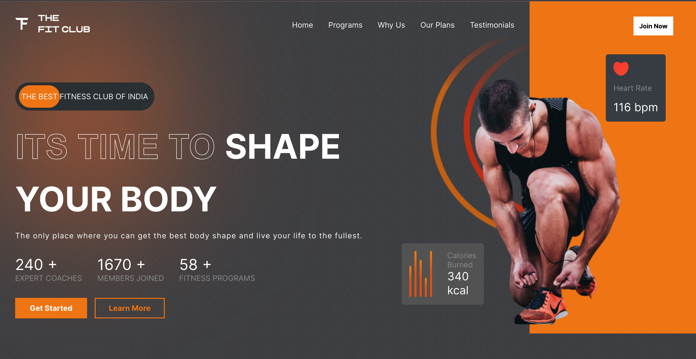

# Fitness Hub : Responsive Fitness Webpage

Welcome to Fitness Hub, your go-to fitness destination built with ReactJS! This responsive web application provides a sleek and engaging interface to help users stay fit and healthy.

## Preview

## Features
- Responsive Design: Access the fitness content seamlessly on any device.
- Engaging Animations: Enjoy a dynamic and interactive user experience.
- Email Integration: Connect with us effortlessly through EmailJs.
- Animated Counters: Track your progress with visually appealing number counters.
- User-friendly Interface: Navigate through the content with ease.

## Technologies Used
#### Frontend Stacks
- Framework: ReactJs
- Animation: Framer Motion
- Email Integration: EmailJs
- Number Counters: Custom CSS

## Getting Started
Explore Fitness Hub and start your fitness journey by following these steps:

###### Clone the repository to your local machine:
- `git clone https://github.com/your-username/fitness-hub.git`

###### Install dependencies for the frontend:
- `cd fitness-hub`
- `npm install`

###### Start the development server:
- `npm start`

###### Access the app in your web browser at http://localhost:3000.

## Contact
Have questions or feedback? Feel free to reach out to me at sankalpforwork@gmail.com.
